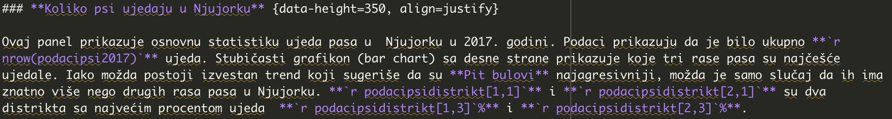
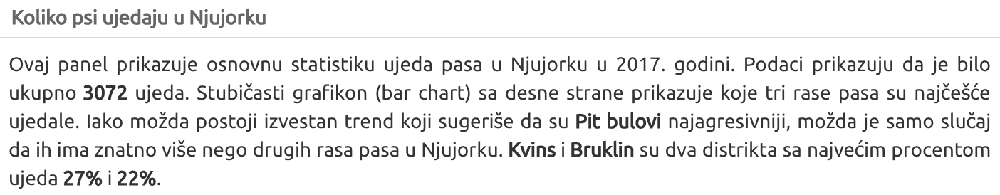
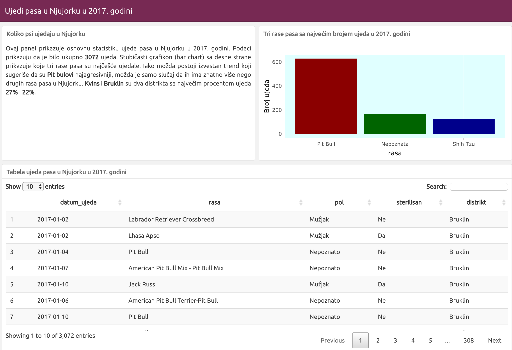

## **Vežba: skup podataka ujedi pasa u Nju Jorku** 
 <center> Tijana Blagojev - R-Ladies Belgrade </center>


<style type="text/css">
  .reveal p {
    text-align: justify;
  }
  .reveal ul {
    display: block;
  }
  .reveal ol {
    display: block;
  }
  
</style>

<section>
    
</section>

## Pre radionice

- Instalirajte R: 
  - https://cran.r-project.org/  

- Instalirajte R-Studio:
  - https://rstudio.com/products/rstudio/download/  

- Otvorite nalog na Netlify: 
  - https://app.netlify.com  


## Cilj ove vežbe


- Upoznaćemo kako R funkcioniše

- Naučićemo različite vrste varijabli 

- Samo ćemo se dotaći nekoliko R paketa poput delova paketa tidyverse (dplyr i ggplot2) 

- Napravićemo [panel sa informacijama koje se nalaze u skupu podataka ujedi pasa](https://tixwitchy.github.io/Psi_iz_Nju_Jorka/Psi-iz-Nju-Jorka.html)

## Vežba{align=right}

- Sa linka preuzmite folder sa vežbom:
 https://github.com/tixwitchy/Psi_iz_Nju_Jorka

- Klinkite na **Clone** zeleno dugme i potom **Download ZIP**

- Otvorite fajl **Psi_iz_Nju_Jorka.Rproj** 

- U levom donjem delu R Studio-a tzv. konzole (Console) kopirajte sledeći kod i kliknite enter:

```{r eval=FALSE, message=FALSE}
install.packages(c("flexdashboard", "tidyverse", "plotly", "DT"))
```


## Prvi koraci

- Pošto ste instalirali R i R Studio potrebno je da **set a working directory** (postavite direktorijum) gde će se čuvati sav rad na određenom projektu/zadatku.

- Najbolje je da izberete **File/New Project** koji će automatski čuvati podatke na istom mestu.

- Pošto smo već otvorili fajl **Psi_iz_Nju_Jorka.Rproj** radni direktorijum je već setovan.


## R Interfejs 

<section>
    
</section>

## Paketi i biblioteke 

Kada instalirate R, imate osnovne funkcije koje su vam na raspolaganju u okviru tzv.  Base R (osnovnog R-a).

Medjutim, kako biste pristupili funkcijama ili podacima koje su drugi ljudi napravili ili prikupili postoje brojni R paketi koji su vam na raspolaganju. 

**R paket** je skup funkcija (koda), podataka, dokumentacije, vinjeta (primera).

**Važna napomena** - R je **osetljiv na velika i mala slova** tako da pripazite na pisanje i velika i mala slova!

## Paketi i biblioteke-Kod

Kako biste pristupili informacijama koje se nalaze u R paketu, potrebno je prvo da su ti paketi instalirani i potom da im se pristupi kroz njihove biblioteke. Koristite sledeći kod da biste instalirali pakete i uvezli biblioteke.


```{r eval=FALSE, message=FALSE}

install.packages("flexdashboard")

install.packages("tidyverse")

install.packages("plotly")

install.packages("DT")

```
```{r,message=FALSE}
library (flexdashboard)

library (tidyverse)

library (plotly)

```


## Jednostavna upotreba R-a

Ukucajte u vašoj konzoli sledeću komandu i pritisnite enter.

```{r}
2 + 2
```

Koristite **<-**  da biste napravili objekte u R-u. On se zove assignement operator (operator dodele).

```{r}
x <- 5
y <- 10
z <- x + y
z
```


## Set podataka

Set podataka o ujedima pasa je preuzet iz [R paketa nycdogs Kierana Healy-ja](https://kjhealy.github.io/nycdogs/). Za našu vežbu adaptiran je na srpski jezik, uključuje samo 2017. godinu i nekoliko varijabli. Pa hajde da pogledamo kako set podataka izgleda.

**Važna napomena**: Retko ćete zaista naići na set podataka koji je već pripremljen za analizu. Obično je potrebno izmedju 50% i 80% vremena da očistite i pripremite podatke. 

## Pregledanje seta podataka

Prvo ćemo da unesemo i pregledamo csv fajl o ujedima pasa u Nju Jorku za 2017. godinu uz pomoć sledećeg koda:
```{r, message=FALSE}

podacipsi2017 <- read_csv ("datadogs2017.csv")


```

## Pregled seta podataka

Set podataka ima 3072 reda koje ćemo zvati obzervacije i 6 kolona koje ćemo zvati varijable.  Kao što možete da vidite, postoje različiti tipovi varijabli kao što su karakter, datum, decimalni.
```{r}
glimpse (podacipsi2017)
```


## Varijable

**Merljive** su one varijable čija vrednost je izražena numerički (Numeric):

- **Ceo broj/Integer**: Godine, broj mačića

- **Realni (Decimalni)/Double (Continuous)**: Visina, težina

**Atributivne** su one čija vrednost je prikazana u vidu karakteristike ili atributa:

- **Karakteri**: Crno, žuto, belo

- **Faktori (ordinalne)**: Hladno, mlako, toplo, vruće


## Kreiranje R markdown panela 
U gornjem levom uglu pritisnite ikonu belog dokument sa plus znakom i izaberite R Markdown. Potom kliknite i otvorite Flex Dashboard templejt.

## Kreiranje R markdown panela 

<section>
    
</section>

## Flexdashboard templejt 
<section>

</section>
## Uredjivanje izgleda Flexdashboard/panela
```{r,eval=FALSE}
---
title: "Ujedi pasa u Nju Jorku u 2017. godini"
output: 
  flexdashboard::flex_dashboard:
    orientation: columns
    vertical_layout: fill
    theme: united
---
```


## Pipe operator/Operator cev 

U tidyverse paketu postoji takozvani operator "cev"/pipe operator **%>%**. On prenosi rezultat sa leve strane kao prvi argument funkcije na desnoj strani. Zapravo povezuje više operacija nad podacima. 

## Setup deo  R-markdown-panel dokumenta

U **Setup delu** koda, mi ćemo uneti set podataka o ujedima pasa i kreirati podskup ujeda prema distriktu koji nam je potreban za tekstualni deo panela. 

```{r, eval=FALSE}
podacipsi2017<- read_csv ("datadogs2017.csv")
```
```{r}
podacipsidistrikt <- podacipsi2017 %>%
  
  group_by (distrikt) %>%
  
  tally() %>% #  funkcija koja se koristi za brojanje slučajeva ujeda
  
  arrange (desc (n)) %>% # nova kolona n (broj ujeda) poredjaćemo od najvećeg ka najmanjem
  
  mutate (procenat = round ((n/sum(n)) * 100, 0)) # dodaćemo još jednu kolonu za procente i nazvati je procenat
```

## Setup deo R-markdown-panel dokumenta

<section>

</section>


## Broj ujeda prema distriktu u Nju Jorku

Sada ćemo pogledati prvih 5 distrikta sa najvećim brojem ujeda

```{r}
head (podacipsidistrikt, 5)
```

## Tekstualni deo panela 

Koristićemo znak  **`**, koji prati slovo **r** i odredjena funkcija koju ćemo zatvoriti sa istim znakom. Na ovaj način će nam se automatski uneti rezultat funkcije u tekst. Na primer, ako bismo koristili podskup za neku od sledećih godina, kod će automatski ažurirati podatke u tekstu. Kako biste pristupili odredjenoj vrednosti iz skupa podataka možete da koristite sledeći kod gde prvi broj u zagradi označava broj reda a drugi broj kolone.

```{r}
podacipsidistrikt[1, 1]
```

## Tekstualni deo panela-Kod
```{r, eval=FALSE}

### **Koliko psi ujedaju u Nju Jorku** {data-height=250, align=justify}

Ovaj panel prikazuje osnovnu statistiku ujeda pasa u  Nju Jorku u 2017. godini. 
Podaci prikazuju da je bilo ukupno **`r nrow(podacipsi2017)`** ujeda. 
Stubičasti grafikon (bar chart) sa desne strane prikazuje koje tri rase pasa su najčešće ujedale. 
Iako možda postoji izvestan trend koji sugeriše da su **Pit bulovi** najagresivniji,
možda je samo slučaj da ih ima znatno više nego drugih rasa pasa u Nju Jorku. 
**`r podacipsidistrikt[1,1]`** i **`r podacipsidistrikt[2,1]`** 
  su dva distrikta sa najvećim procentom ujeda  **`r podacipsidistrikt[1,3]`%** i **`r podacipsidistrikt[2,3]`%**.

### **Tabela ujeda pasa u Nju Jorku u 2017. godini** {data-height=750}

```

## Tekstualni deo panela kod i rezultat {data-background-size=40% }
<section>
    
    
</section>
## Čestitam upravo ste programirali i "ištrikali" vaš prvi panel!!!
<section>

</section>
## Kreiranje pretražive tabele

Prvo ćemo u Setup delu našeg templejta za panel, napraviti podskup koji neće sadržati kolonu poštanski broj.
```{r}
podacipsitabela <- podacipsi2017 %>%
  select (-poštanski_broj)
```

Potom ćemo dodati pretraživu tabelu odmah ispod naslova **Tabela ujeda pasa u Nju Jorku u 2017. godini**  uz pomoć DT paketa. 
```{r, eval=FALSE}
DT :: datatable (podacipsitabela, options = list(
  bPaginate = TRUE))

```


## Kako nam panel napreduje
<section>

</section>


## Kreiranje stubičastog grafikona

Prvo, napravićemo podskup sa tri rase pasa sa najviše ujeda. Ponovo ćemo ovaj deo koda staviti u prvi  **Setup deo** našeg R panela/R markdown fajla. 

```{r,message=FALSE}
podacipsirasa <- podacipsi2017 %>%
  
  group_by (rasa) %>% #grupisanje prema varijabli rasa
  
  tally () %>% #tally izračunava broj ujeda prema rasi jer smo prethodno tako grupisali
  
  rename (Broj_ujeda = n) %>% #pošto imamo kolonu "n" promenićemo joj ime
  
  arrange (desc (Broj_ujeda)) %>% #poređaćemo rase prema broju ujeda od najvećeg ka najmanjem 
  
  top_n(3) #izabraćemo samo prve tri rase 


```


## Korišćenje paketa ggplot2 i plotly

Koristićemo dva paketa za izradu grafikona, jedan (ggplot2) kreira stubičasti grafikon, a drugi (plotly) omogućiće da se pojave informacije kada se pređe kursorom preko grafikona. Ggplot2 je paket koji je napravio [Hadley Wickam](https://resources.rstudio.com/authors/hadley-wickham) koji se zasniva na takozvanoj gramatici grafikona. 

## Gramatika grafikona

Ona vam omogućava da napravite grafikon u vidu slojeva kako biste kreirali grafički prikaz koji želite. 

- podaci

- estetsko mapiranje

- geometrijski objekti

- statističke transformacije

- skale

- koordinatni sistem

- repozicioniranje

- više panela jedan do drugog/faceting


## Kreiranje stubičastog grafikona

Umesto Chart B napisaćemo: **Tri rase pasa sa najvećim brojem ujeda u 2017. godini** i koristićemo ovaj kod za izradu grafikon.

```{r, eval=FALSE}

p <- ggplot (data = podacipsirasa) +  #podaci koji nam trebaju za grafikon
  
     geom_col (aes (x = rasa, y = Broj_ujeda),#ovde imamo estetsko mapiranje (određivanje x i y ose) i geometrijski objekat tj biramo vrstu grafikona
             fill = c("darkred", "darkgreen", "darkblue")) +     #određujemo boju svakog stuba
     ylab ("Broj ujeda") +   #dodajemo naslov y osi
  
     theme (legend.position = "none", #stilsko sređivanje grafikona
            
          panel.background = element_rect (fill = "lightcyan"))  #sklonićemo legendu i promenićemo boju pozadine

#Promenićemo ga u interaktivni grafikon uz pomoc paketa plotly
p <- ggplotly (p)
p

```

## Stubičasti grafikon 
Kao što možete da primetite redosled nije baš kako treba
<style> div[id*="htmlwidget"] { margin: auto; } </style>
```{r,echo=FALSE}
p <- ggplot (data = podacipsirasa) +  #podaci koji nam trebaju za grafikon
  
     geom_col (aes (x = rasa, y = Broj_ujeda),#ovde imamo estetsko mapiranje (određivanje x i y ose) i geometrijski objekat tj biramo vrstu grafikona
             fill = c("darkred", "darkgreen", "darkblue")) +     #određujemo boju svakog stuba
     ylab ("Broj ujeda") +   #dodajemo naslov y osi
  
     theme (legend.position = "none", #stilsko sređivanje grafikona
            
          panel.background = element_rect (fill = "lightcyan"))  #sklonićemo legendu i promenićemo boju pozadine

#Promenićemo ga u interaktivni grafikon uz pomoc paketa plotly
p <- ggplotly (p)
p

```

## Promena varijable karakter u faktor

Dodaćemo **Setup delu** našeg fajla sledeći kod koji će transformisati varijablu karakter-**rasa** u faktor. Odredićemo joj nivoe kako bi se ispravno prikazao broj ujeda u odnosu na rasu  - prvi nivo je rasa Pit Bull, zatim Nepoznata i na kraju Shih Tzu. 

Napomena: Kako biste koristili određenu kolonu/varijablu u R-u, povezujemo set podataka sa tom kolonom uz pomoć oznake za dolar.

```{r}
# Promena nivoa kako bi se redosled na grafikonu ispravno prikazao

podacipsirasa$rasa <- factor (podacipsirasa$rasa,
                               levels = c ("Pit Bull", "Nepoznata", "Shih Tzu"))
```


## Kako nam panel napreduje
<section>

</section>

## Poslednja faza - Braaavoo!!!!
<section>

</section>

## Stubičasti grafikon sterilisanih pasa

U ovoj poslednjoj fazi, kreiraćemo malo kompleksniji grafikon koji će prikazivati koliko je pasa  bilo sterilisano i prema polu. Ponovo ćemo u **Setup delu** kreirati podskup koji je grupisan na osnovu ova sva parametra. Na to ćemo dodati još jednu kolonu koja će se koristiti za informacije koje će se prikazivati kada se pređe preko grafikona.
```{r}
podacipsisterilisanpol <- podacipsi2017 %>%
  
  group_by (sterilisan, pol) %>% 
  
  tally () %>%        #izračunava broj ujeda na osnovu ove dve grupe
  
  mutate (Info = paste ('<br>', "Sterilisan:", # Kreiranje nove varijable Info koja će služiti za prikazivanje informacija
                        sterilisan, '<br>',#"<br>" se koristi da naznači kraj reda
                        
                        "Broj ujeda:", n, '<br>',
                        "Pol:", pol, '<br>'))  
```

## Promena varijable karakter u faktor

Ponovo ćemo promeniti redosled u varijabli sterilisan i pretvoriti je u faktor
```{r}
# Promena nivoa kako bi se redosled na grafikonu ispravno prikazao

podacipsisterilisanpol$sterilisan <- factor (podacipsisterilisanpol$sterilisan ,
                               levels = c ("Ne","Da"))
```


## Podskup podacipsisterilisanpol

```{r, echo=FALSE}

kableExtra:: kable(podacipsisterilisanpol)

```

## Kreiranje poslednjeg grafikona

Umesto  Chart C napisaćemo i centrirati naslov: **Ujedi prema polu psa i da li je bio sterilisan/a** {align=center} i koristićemo sledeći kod za grafikon:
```{r,eval=FALSE,warning=FALSE}
p1<- ggplot (data = podacipsisterilisanpol)+ #podaci za mapiranje
  
  geom_col (aes (x = sterilisan, y = n,  #geometrijski objekat i estetsko mapiranje 
                 
                 fill = pol, label = Info)) + #kreiranje jos jedne dimenzije za pol u samom stubus i upotreba kolone info za prikazivanje informacija
  
  scale_fill_manual (values = c('cyan3', 'darkorange', "purple")) + #dodeljivanje boja za pol
  
  ylab ("Broj ujeda") +
  
  theme (legend.position = "none",
    panel.background = element_blank())

p1<-ggplotly(p1, tooltip = "Info") # dodavanje u plotly funkciji informacije iz kolone Info
p1
```

## Poslednji grafikon

```{r,echo=FALSE,warning=FALSE}
p1<- ggplot (data = podacipsisterilisanpol)+
  
  geom_col (aes (x = sterilisan, y = n, fill = pol, label = Info)) +
  
  scale_fill_manual (values = c('cyan3', 'darkorange', "purple")) +
  
  ylab ("Broj ujeda") +
  
  theme (legend.position = "none",
         
    panel.background = element_blank())

p1<-ggplotly(p1,tooltip = "Info")

p1
```

## Panel je završen 

<section>
<a href="https://tixwitchy.github.io/Psi_iz_Nju_Jorka/Psi-iz-Nju-Jorka.html">
 </a>
</section>


## Obratite pažnju i vodite računa

> *"Mi pretpostavljamo da nešto što vidimo u podacima može da se primeni van okvira u kome su ti podaci nastali (vreme, mesto i uslovi)."* 
>
> --- Ben Jones, Kako izbeći pogrešan pristup u radu sa podacima


## Obratite pažnju i vodite računa

- Kako bismo mogli da zakljucimo da su **Pit Bull**-ovi zaista agresivni potrebno je da se uradi još istraživanja.

- Da li je realno da se izvode zaklučci na osnovu ovolikog broja obzervacija? Da li su podaci pouzdani?

- Zato je poželjno da eksperti u svojim oblastima znaju da naprave ovakve vizuelne prikaze. Oni već poseduju ekspertizu na osnovu koje mogu da izvuku ispravne zaključke. Ovaj  alat može da im pomogne da dođu do šire publike kao i da im omogući da prate i doprinose radu drugih stručnjaka. 

## Primer kombinovanja Flexdashboards i Shiny

<section>
<a href="https://tixwitchy.shinyapps.io/minority_media/">
 </a>
</section>

## Gde da objavite vaše kreacije

- [Netlify](https://app.netlify.com/drop)

- [Github stranice](https://pages.github.com/)

- Ako vaš panel sadrži shiny elemente možete da ih objavite putem [Shinyapps.io](https://shiny.rstudio.com/deploy/)

## Dodatni resursi

- [Više informacija o Flexdashboards](https://rmarkdown.rstudio.com/flexdashboard/)
- [Flexdashboards i Shiny](https://rmarkdown.rstudio.com/flexdashboard/shiny.html)
- [Sjajan sajt Allison Horst za učenje R-a](https://allisonhorst.shinyapps.io/edge-of-the-tidyverse/)
- [R-ladies Belgrade meetup stranica](https://www.meetup.com/rladies-belgrade/)
- [Moj kontakt ukoliko želite da mi pokažete vaše panele :)](mailto:etijana@gmail.com)


## Bili ste odlični i hvala!
<section>

</section>
